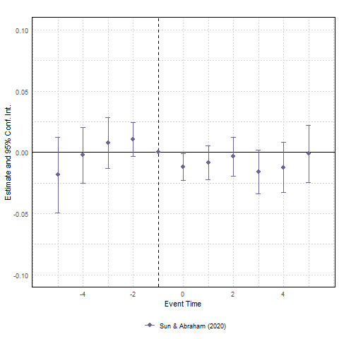
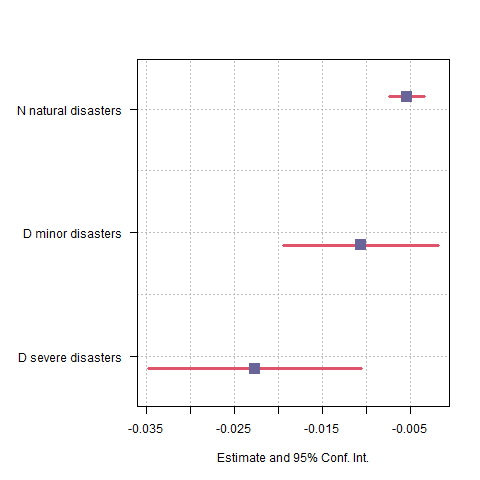
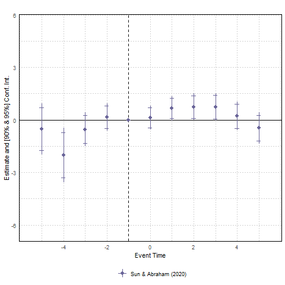
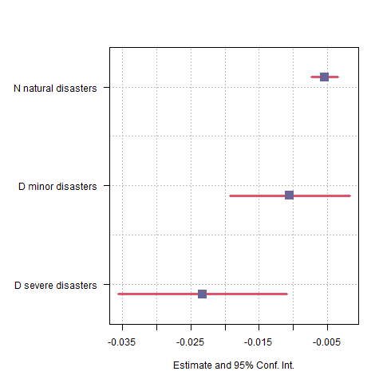
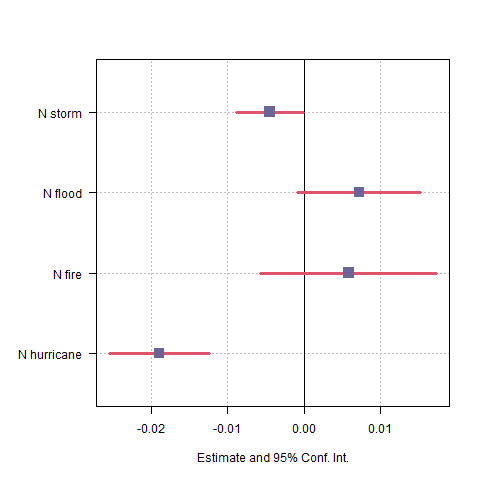

class: center, middle, hide-count

```{r include = FALSE}
library(knitr)
library(dplyr)
library(kableExtra)
library(stargazer)
library(xtable)
library(grid)
library(gridExtra)
library(ggplot2)
library(tidyverse)
library(bookdown)
library(stargazer)
library(png)
library(icons)
library(qrcode)
library(DiagrammeR)
library(sjPlot)
library(DT)
library(widgetframe)
```

```{r xaringan-themer, include=FALSE, warning=FALSE}
library(xaringanthemer)
style_mono_accent(base_color = "#0d4080",
    base_font_size = "12px",
  text_font_size = "2rem",
  code_font_size = "1.5rem",
  header_font_google = google_font("Roboto"),
  text_font_google   = google_font("Arial"),
  code_font_google   = google_font("IBM Plex Mono"),
  link_color = "#9c0566",
  text_bold_color = NULL,
  inverse_text_color = "#ffffff",
  inverse_text_shadow = FALSE,
  inverse_link_color = "#ffffff",
  inverse_header_color = "#ffffff")
```


```{r, load_refs, include=FALSE, cache=FALSE}
#library(RefManageR)
#BibOptions(check.entries = FALSE,
 #          bib.style = "authoryear",
  #         style= "text",
   #        hyperlink = FALSE)
#myBib <- ReadBib("gender.bib", check = FALSE)
```

```{css echo=FALSE}
.hide-count .remark-slide-number {
  display: none;
}

```

```{r xaringan-tile-view, echo=FALSE}
js <- c(
  "function(settings){",
  "  var datatable = settings.oInstance.api();",
  "  var table = datatable.table().node();",
  "  $(table).append('<caption style=\"caption-side: bottom\">' + caption + '</caption>');",
  "}"
)
xaringanExtra::use_tile_view()
```


<br>
<br>

# (Not) Going to school in times of climate change: 
# Natural disasters and student achievement


<br>


.large[Sarah Gust]


<br>
Center Seminar  

November 30, 2023

<br>


<br>


---


# Motivation 

.center[
### Fig. 1: Billion dollar disasters
```{r out.width = '70%' , echo=FALSE}
 
```
]
.footnotesize[Source: https://www.ncei.noaa.gov/access/billions/time-series]

---

# Motivation 

.pull-left[
- 22,112 prolonged unplanned school closures in 2011-2019, affecting over 13 million students that resulted in 91.5 million student-days lost (Jahan et al. 2022).
- 18.7% of all schools had at least one prolonged school closure ( $\geq$ 5 days). 
- Natural disasters (47%), adverse weather conditions (35%) are the most frequent reason.
- Hurricane Harvey led to >3000 schools closed in four states ranging from 1-19 days.
]
.pull-right[
### Fig. 2: School closure
```{r out.width = '90%' , echo=FALSE}
knitr::include_graphics("index/closures_all.png") 
```
]


.footnotesize[Data.CDC.gov database: Prolonged Unplanned School Closures: USA, 2011-2019.]

---

# Motivation

.pull-left[
- The occurrence and expenses associated with natural disasters have risen (and could continue to do so).
- Natural disaster can lead to school closures, breakdown of transit system, or even destroy school buildings and housing. 
- Potentially lasting effects on students' achievement.
- Implications for individual returns and human capital.
- Understanding the costs of natural disasters is crucial for pre- and post-disaster investment and policies.

]

.pull-right[
```{r out.width = '55%' , echo=FALSE}
knitr::include_graphics("index/hurrycane_nyt.JPG") 
```

```{r out.width = '55%' , echo=FALSE}
knitr::include_graphics("index/ahrtal_sz.JPG") 
```
]

---


# This Paper

**Main Question:** What are the effects of natural disasters on student achievement? 

--

## How? 

- **Data:** Combining county level student achievement (SEDA) for 2009-2018 with disaster declarations in the US from the Federal Emergency Management Agency (FEMA).

--

- **Framework:**  Exploit variation across US counties and years in TWFE setting 
      
  `r fontawesome::fa('long-arrow-alt-right')` Sun & Abraham DiD event study design with first year of natural disaster
      
  `r fontawesome::fa('lightbulb')` How does the effect evolve over time? Assess common trends.

--

  `r fontawesome::fa('long-arrow-alt-right')` TWFE with number or severity of natural disasters in the past five years 

  `r fontawesome::fa('lightbulb')` Are more disasters more detrimental or are counties adapting? 

--

  `r fontawesome::fa('lightbulb')`  Do larger disasters cause more harm?


---

# Data on Student Achievement

## Stanford Education Data Archive (SEDA) 2009-2018 
**District and county level average achievement** (for all students and by race/ethnicity and gender), district and county level racial/ethnic and gender achievement gaps, and district level demographic/socioeconomic data.

- **Achievement is centered around zero**, so a score of zero means the county is at the average expected level of achievement within the United States. One-unit below zero means that students in the county are one grade level behind the average; one-unit above zero means that students in the county are one grade level above the average. 

`r fontawesome::fa('long-arrow-alt-right')`  Use county level and focus on grade 3.


```{r, echo=FALSE}
#t <- read.table(file = "../tables/seda_summary.txt", sep = ",")
#rownames(t) <- c("Achievement All Students", "Male-Female Gap", "Non-ECD-ECD Gap", "White-Black Gap", "White-Hispanic Gap")
#t %>% head() %>%
#  knitr::kable(format = "html", align = "ccc")  
 
```


---
# Data: Math scores 

.center[
### Fig. 3: Average Math Achievement Grade 3 to 5
```{r out.width = '75%' , echo=FALSE}
knitr::include_graphics("index/math.png") 
```
]
---
# Data on Disasters (I): FEMA

- OpenFEMA Dataset by the Federal Emergency Management Agency (FEMA) of the Department
of Homeland Security
- Major disaster declarations 2009-2018 (begins in 1964)
- A disaster declaration is only made (by the President of the United States) in strongly affected areas that struggle to deal with the consequences `r fontawesome::fa('long-arrow-alt-right')` rules out inconsequential natural disasters. 
- The disaster declaration includes the date the disaster was declared, the area, the type of incident, denotes which assistance program was declared. 
- Storms (73%), Floods (20%), Fire (7%), Drought (2%), Freezing, Earthquake, Landslide, Volcanic activity. 
- One disaster can cause multiple disaster events across different counties. 
- For large disasters: Information of fatalities from EM-DAT via county and start date.
- Define severe natural disasters as disasters that caused $\geq$ 25 deaths (following Bounsat et al. 2020).

---
# Treatment year

.center[
### Fig. 4: First year of natural disaster
```{r out.width = '75%' , echo=FALSE}
knitr::include_graphics("index/fema_first_year.png") 

```
]
---
# Number of natural disasters

.center[
### Fig. 5: Number of natural disasters between 2009 and 2018
```{r out.width = '75%' , echo=FALSE}
 

```
]

---
# Contribution to existing literature

### Literature on school closures and absenteeism 
Covid papers eg. Werner & Woessmann (2023), teacher and student absenteeism eg. Clotfelder, Ladd, and Vigdor (2006), Miller, Murnane, and Willett (2006)

`r fontawesome::fa('long-arrow-alt-right')` Natural disaster fundamentally different from Covid. 
`r fontawesome::fa('long-arrow-alt-right')` Natural disasters can be seen as an exogenous shock to absence. 
`r fontawesome::fa('long-arrow-alt-right')` Eg. infrastructure damages are possible.

---

### Literature on specific major disasters on schools and students 
- Sacerdote (2012) for students that were forced to switch school after hurricane Katrina and Rita, there was a sharp decline in test scores in the first year after the hurricanes. Long term effects are mixed.
- Di Pietro (2019): earthquake in Italy reduced students’ probability of graduating on-time and slightly increased students’ probability of dropping out. 

`r fontawesome::fa('long-arrow-alt-right')` However, most disasters are not as severe as those outliers.
`r fontawesome::fa('long-arrow-alt-right')` Focus on young kids (grade 3).

--

- Husted, Opper, Park (2023): very similar paper (same data), focus on static effect:  

$\Delta y_{i,t} = \alpha \sum \tau_k D^k_{c,t} + \theta_t + \epsilon_{i,t}$ 

where $D^k_{c,t}$ is an indicator function of whether county c in year t is in bin k. The five bins are no, small, medium, large, very large disasters. $\Delta y_{i,t}$ is the year-to-year change in outcome. Effect on migration, average test score, and post secondary enrollment. 

---
# Model 

We're interested in the dynamic effects:  

- Problem: Staggered adoption, coefficients on lead and lag indicators in a dynamic specification can be biased with TWFE.
- Solution: reweighting following Sun and Abraham (2021)

## Target parameter 

**Cohort average treatment effect on the treated** for a treatment cohort $e$ and relative time period $l$ 

$$CATT_{e,l} = E[Y_{i,e+l} - Y^{\infty}_{i,e+l}|E_i = e]$$

$Y^{\infty}_{i,e+l}$ is the potential outcome of county $i$ in a world where it is untreated. 

Here, a treatment cohort $e$ are counties that are treated at the same time. $l$ are periods to i's initial natural disaster.

---
name: iw
# Dynamic Treatment effect following Sun & Abraham (2021)
Estimate the event study regression using "last treated" as control (C):

  $$Y_{i,t} = \alpha_i + \lambda_t + \sum_{e \notin C} \sum_{l \neq -1} CATT_{e,l}(1\{E_i =e \} \cdot D_{i,t}^l) + \epsilon_{i,t}$$
--

### The interaction weighted estimator 

Take the weighted average over all estimates for $CATT$ multiplied by the sample share of each cohort in the period $Pr(E=e)$:

$$\hat v_g = \frac{1}{|g|} \sum_{l \in g} \sum_{e} \widehat{CATT_{e,l}} \hat Pr(E_i = e| E_i \in [-l, T-l])$$
--
Main assumptions: Parallel trends for all units, Limited anticipation 
---
# Results

.center[
### Fig. 5: Math achievement in grade 3, 4, and 5 
```{r out.width = '33%' , echo=FALSE}
knitr::include_graphics("index/sunab_fema_math_3.png") 
knitr::include_graphics("index/sunab_fema_math_4.png") 
 
```
]

---

# Alternative specification 

Do more disasters cause more harm?

  $$Y_{i,t} = \alpha_i + \lambda_t + \beta Disaster_{i,t} + \delta'(\mathbf{X}_i \lambda_t) +  \epsilon_{i,t},$$
where $Disaster_{i,t}$ is the number of natural disasters in the past 5 years in a county and year, $\alpha_i$  and $\lambda_t$ are county and year fixed effects, $\mathbf{X}_i \lambda_t$ includes an interaction between initial county population and a linear time trend. 

---
# Alternative specification 

Do larger disasters cause greater harm?


  $$Y_{i,t} = \alpha_i + \lambda_t + \delta_1 Minor_{i,t}^{1-5} + \delta_2 Major_{i,t}^{1-5}  + \delta'(\mathbf{X}_i \lambda_t) +  \epsilon_{i,t},$$
Following the literature, $Minor_{i,t}$ and $Major_{i,t}$ are indicators equal to 1 if the county experienced a minor or major disaster in the past five years, $\alpha_i$  and $\lambda_t$ are county and year fixed effects, $\mathbf{X}_i \lambda_t$ includes an interaction between initial county population and a linear time trend. Thus the $\delta_1$ and $\delta_2$ parameters provide estimates of the impact of any type of disaster that falls into either of these two categories.

The preferred measure of a "severe" disaster is one that caused 25 or more deaths, following Boustan et al. (2020). 

---
name: size
# Results: Number and size of natural disasters

.center[
### Fig. 6: Number and size of natural disasters in the past 5 years.
```{r out.width = '40%' , echo=FALSE}
 
```
]
[Based on cost](#cost)

---
name: robustness
# Robustness and Sensitivity

- Sun and Abraham: Using never treated as [control](#nevertreated). 
- Results look similar with [Borusyak, Jaravel, and Spiess (2023)](#borus).

--

## Mechanism 
Human capital loss is detrimental by itself. But can we identify channels for more targeted policies?
- Out-migration?
- Mental health (open)
- Other?

---
name: migration
# Mechanism: Effect of net migration 

.center[
### Fig. 8: Results for net migration (Sun and Abraham) 
```{r out.width = '40%' , echo=FALSE}
 

```
]

[Enrollment](#enrollment)
---
# Conclusion (for now)

- What is the effect of natural disasters on students?
- Setting: Number and consts of natural disasters have been increasing, already now 80% of the unplanned school closures are due to natural disasters and adverse weather conditions.
- Evidence points to a negative effect of natural disaster on student achievement.
- More natural disasters cause more harm. This effect is larger for large natural disasters. 
- However, parts of the effect could be explained by out migration. 

Next step:
- Individual level data with effects on mental health. 

---
class: middle, center, inverse

Thank you!


---
# Descriptive Table

```{r descr, echo=FALSE}
t <- read.csv(file = "index/seda_summary.csv", sep = ",")
font.size <- "8pt"
t %>% datatable(rownames = FALSE, 
    options = list(
      drawCallback = JS(js),
      scrollY = 400,
      pageLength = 20,
        initComplete = htmlwidgets::JS(
          "function(settings, json) {",
          paste0("$(this.api().table().container()).css({'font-size': '", font.size, "'});"),
          "}")
    ),
    height = 600,
  ) %>% frameWidget() 
```

---
name: cost
# Alternative Larger natural disasters cause more harm

.center[
```{r out.width = '40%' , echo=FALSE}
 
```
]
A "severe" disaster is one that caused more than 1 bn dollar damage (adjusted)
[Go back](#size)

---
name: nevertreated

# Sun and Abraham with never treated 
.center[
```{r out.width = '40%' , echo=FALSE}
knitr::include_graphics("index/sunab_fema_math_3_nevertreated.png") 
```
]
[Go back](#robustness)

---
name: borus
# Imputation method 

.center[
```{r out.width = '40%' , echo=FALSE}
knitr::include_graphics("index/borus_fema_math_3.png") 
```
]

Intuition: Borusyak et al. 2021 imputes Y(0) with not-yet treated and never treated units. 

[Go back](#robustness)

---
name: enrollment
# Enrollment

.center[
```{r out.width = '45%' , echo=FALSE}
knitr::include_graphics("index/sunab_fema_enrollment.png") 
```
]

[Go back](#migration)

---
name:types
# Disaster types

.center[
```{r out.width = '45%' , echo=FALSE}
 
```
]

[Go back](#robustness)

---
# Disaster Count
.center[
### Fig. 7: Number of natural disasters between 2009 and 2018
```{r out.width = '50%' , echo=FALSE}
 

```
]
