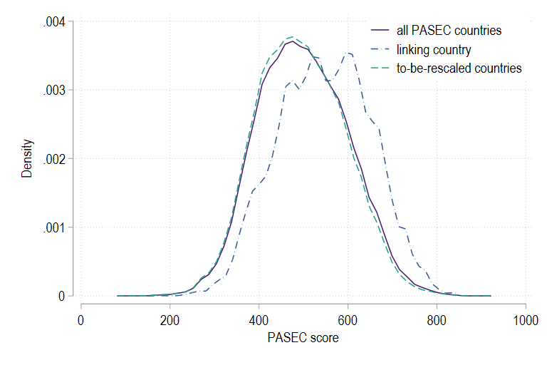

class: center, middle, hide-count

```{r include = FALSE}
library(knitr)
library(dplyr)
library(kableExtra)
library(stargazer)
library(xtable)
library(grid)
library(gridExtra)
library(ggplot2)
library(tidyverse)
library(bookdown)
library(stargazer)
library(png)
library(icons)
library(qrcode)
library(DiagrammeR)
```

```{r xaringan-themer, include=FALSE, warning=FALSE}
library(xaringanthemer)
style_mono_accent(base_color = "#0d4080",
    base_font_size = "12px",
  text_font_size = "2rem",
  code_font_size = "1.5rem",
  header_font_google = google_font("Roboto"),
  text_font_google   = google_font("Arial"),
  code_font_google   = google_font("IBM Plex Mono"),
  link_color = "#9c0566",
  text_bold_color = NULL,
  inverse_text_color = "#ffffff",
  inverse_text_shadow = FALSE,
  inverse_link_color = "#ffffff",
  inverse_header_color = "#ffffff")
```


```{r, load_refs, include=FALSE, cache=FALSE}
#library(RefManageR)
#BibOptions(check.entries = FALSE,
 #          bib.style = "authoryear",
  #         style= "text",
   #        hyperlink = FALSE)
#myBib <- ReadBib("gender.bib", check = FALSE)
```

```{css echo=FALSE}
.hide-count .remark-slide-number {
  display: none;
}

```

```{r, caption_datatable, include=FALSE, cache=FALSE}
js <- c(
  "function(settings){",
  "  var datatable = settings.oInstance.api();",
  "  var table = datatable.table().node();",
  "  $(table).append('<caption style=\"caption-side: bottom\">' + caption + '</caption>');",
  "}"
)

xaringanExtra::use_tile_view()
```
<br>
<br>

# Global Universal Basic Skills: 
# Current Deficits and Implications for World Development


<br>


.large[Sarah Gust &nbsp;&nbsp;&nbsp; Eric A. Hanushek  &nbsp;&nbsp;&nbsp; Ludger Woessmann]


<br>
CeFH Seminar   

November 3, 2023

<br>


<br>


---

# Global Universal Basic Skills

Make your guess: 

How many children in the world do not reach basic skill levels (e.g., PISA Level 1)? 

--

## Development goal

- Ensuring that all of the world’s youth have at least basic skills is a prime development goal by itself 
- Also has immense importance for inclusive and sustainable world development:  People are no longer just competing with workers in adjoining cities or states, as most products can be produced anyplace in the world.
- One of United Nations’ Sustainable Development Goals (SDGs): Ensure quality education for all 
- But: limited country coverage of int’l tests 

`r fontawesome::fa('long-arrow-alt-right')` unclear how many children currently fail to reach basic skills 

--

## This Paper 

1. How far are we away from reaching basic skills for all children around the globe? 
2. What would it mean for world development to reach global universal basic skills?


---
# This Paper

`r fontawesome::fa('long-arrow-alt-right')` Draw on individual-level test data from int’l and regional student assessments to estimate share of children not achieving basic skills in each country; then show economic costs of these deficits

--

- **The available student achievement data**
  
  - Tests designed to provide internationally comparable information on math and science achievement 
  - Each test surveys representative samples of students in the participating countries
  
--

- **Key methodological challenge** (to be discussed next)
  - Combine available assessment information on a common achievement scale
  
--

- **Analytic sample: all countries in the world that** 
  - Have a population of at least 1 million or 
  - Represent at least 0.01% of world GDP
  - Exclude North Korea, Somalia, South Sudan, Syria, Venezuela, and Yemen (lack reliable population/GDP data) 
  `r fontawesome::fa('long-arrow-alt-right')` 159 countries that cover 98.1% of world population and 99.4% of world GDP 
  
---
class: bottom, center, inverse
background-image: url(index/school.jpg)
background-size: cover


# 1. Constructing a Global Data Base

---
# Available Skill Data at Different Layers of Reliability 

<div style="text-align: center;">


</div>

---
# Methods: Depicting Skills on a Common Global Scale


.pull-left[
1. **Defining** Global Universal Basic Skills: Fully achieving PISA Level 1 of 6 (420 points in math and 410 for science) 

2. **Transforming** Achievement of Different Int’l Tests onto the PISA Scale (Layers 2+3) 
`r fontawesome::fa('long-arrow-alt-right')` up next

3. Achievement in **China and India** on a Global Scale (Layer 4)

4. **Imputation** of Achievement in Countries without Int’l Test Participation (Layer 5)

5. Skill Levels of **Children Who Are not in School**
]

.pull-right[

]
---
# New Method for Linking Scores Across the Different International Tests (Layer 2 and 3)

Aim: transform student-level achievement on all tests into a PISA-equivalent score 
- While introducing minimal constraints on underlying score distributions 
- Use **student-level distributional information** in group of countries participating in any pair of test regimes

--

Assuming normality, convert any individual TIMSS score, $t_i$, into the corresponding PISA score, $p_i$, by:

$$p_i = \frac{(t_i - m^C_{TIMSS})}{s^C_{TIMSS}} s^C_{PISA} + m^C_{PISA}$$

We use the subset of countries, $C$, that takes the PISA test and TIMSS (or one of the different regional tests) and estimate means and standard deviations of the common countries for the two distributions.

--

- Produce measures of basic skills from resultant database on distribution of achievement 

---
# Conversion of TIMSS achievement onto the PISA scale


---
name: method

# New Method for Linking Scores Across the Different International Tests (Layer 2 and 3)

- Equivalently for the regional tests
- Consideration of full underlying achievement distributions provides common support at student level
  - Particularly relevant for countries (particularly in Sub-Saharan Africa) performing outside observed range of achievement on the broad international tests.
  - Previous transformation methods based on linear extrapolation from country mean scores tend to overestimate these countries’ achievement. [Alternative methods.](#alternative)

<div style="text-align: center;">


</div>

---
# Achievement in China and India on a Global Scale (Layer 4)


---
# Achievement in China and India on a Global Scale (Layer 4)

## Sub-territorial PISA participation
- Use additional national achievement information to estimate national achievement on PISA scale

--

## India 
- Tamil Nadu and Himachal Pradesh participated in PISA 2009
- Average score: 347.9 = rank 72 out of 74 countries/regions
- Educational Initiative test: Tamil Nadu scores 0.032 SD below national mean
`r fontawesome::fa('long-arrow-alt-right')` Shift PISA distribution for Tamil Nadu to estimate national distribution (89.9% below basic skills) 

--

## China 
- China Education Panel Study (CEPS) is a nationally representative survey of (seventh and) ninth graders in the academic year 2013-2014.
- In addition to the nationally representative sample, the CEPS contains a random sample of students in Shanghai.
- Linking method as for Layers 2 and 3 but linking comes from province Shanghai (PISA 2012).

---
# Imputation of Achievement 

We predict the proportion of the students below basic skills in country j as:

$$\rho^j = \alpha_0 + \alpha_1 E^N_j + \alpha_2 GDP_j + v_j + \mu_j + \varepsilon_j$$
where $E^N_j$ is net enrollment in secondary school, $GDP_j$ is gross domestic product per capita, and $v$ and $\mu$ are indicators for world regions and income groups, and $\epsilon$ is an error term. ( $R^2 = 0.835$ )

---
# Skill Level of Children who are not in School 

36 % of the 15-year-olds are not in school `r fontawesome::fa('long-arrow-alt-right')` how many of them are below basic skills?

- PISA-D out-of-school assessment 2018-2020
- PIAAC Data: Dropouts from upper secondary school  

`r fontawesome::fa('long-arrow-alt-right')` Assume that youths outside school perform on average at **25th percentile** of those currently in school in respective country (normal distribution with SD equivalent to in-school youths in respective country)

- Perform sensitivity checks 

---
name: tableskills
# Achievement of Basic Skills

<div style="text-align: center;">

 

</div>

[Sensitivity](#sensitivity_skills)
---

# The Status of World Education: Six Stylized Facts about the Distribution of Basic Skills

1. At least **two thirds** of the world’s youth do not obtain basic skills. 

--

2. The share of children not reaching basic skills **exceeds half in 101 countries** and rises **above 90% in 36** of these countries. 

--

3. Even in **high-income** countries, a **quarter** of children lacks basic skills. 

--

4. Skill deficits reach **94% in Sub-Saharan Africa** and **89% in South Asia** but also hit 68% in Middle East and North Africa and 65% in Latin America. 

--

5. While skill gaps are most apparent for the third of global youth not attending secondary school, fully **63%** of the world’s secondary-school **students** fail to reach basic skills.

--

6. **Half** of the world’s youth live in the **35 countries** that **fail to participate in international tests** and thus lack regular and reliable foundational performance information.

---

# Achievement of Basic Skills

<iframe src="index/world_share_with_oos_10cat.html" width="80%" height = "100%" id="igraph" scrolling="yes" seamless="seamless" frameBorder="0">
</iframe>

---

class: bottom, center, inverse
background-image: url(index/school.jpg)
background-size: cover

# 2. The Economic Gains from Global Universal Basic Skills

---
# The Economic Gains from Global Universal Basic Skills

**Simulation** of economic gains from achieving universal basic skills
- Use estimates of current distribution of student achievement in the world to simulate economic effects of **improved schooling policies** that aid those currently without internationally competitive skills

--
- Projections incorporate prior estimates of how skills of population relate to **economic growth** from Hanushek and Woessmann (2012)
  - Study documents series of econometric analyses that are consistent with interpretation of estimated growth coefficients as causal effect of skills on growth

--
- Time path of improvement recognizes that school reform **takes time** and that transforming a country’s entire labor force takes even longer 


---

# Three Reform Scenarios

.content-box-blue[
### Scenario I:  Current students achieve at least basic skills

All children who are **currently in school** reach at least basic skills.
]
--

.content-box-blue[
### Scenario II: Full participation at current quality

The average achievement of **out-of-school children** is lifted to the average achievement of in-school children in the respective country.

]
--

.content-box-blue[
### Scenario III: **All children** achieve at least **basic skills**

Full participation in secondary school with every student attaining at least the basic skill level.

]


---
name: phases
# Four Phases of Reform


### 1. School reform (2020-2035) 
- $(\tau = 1, …, R)$, assume $R = 15$
- During the reform period R, workers with the initial skill level in the economy are being replaced by cohorts of progressively more skilled workers.

--

### 2. Main replacement (2036-2060) 
- $(\tau= R+1, …, W)$, assume $W = 40$
- Reform fully enacted. Workers of the original skill level will be replaced by the new higher-skilled workers for the next (W-R) years (W = length of work life) 

---
# Four Phases of Reform (cont.)

### 1. School reform (2020-2035) 
### 2. Main replacement (2036-2060) 

###3. Quality consolidation (2061-2075) 
- $(\theta = W+1, …, W+R)$
- For the next R years, labor market cohorts which only partially profited from reform are replaced with new cohorts.

--

### 4. Completely high skilled (after 2075)
- $(\tau = W+R+1, …)$
- Whole workforce has gone through reform.

[Show details](#math_phases)

---
# Economic effects of this upskilling of the labor force

Growth of GDP for each year throughout each of the simulations:

$$g_\tau = \gamma \bar{A_{\tau}}$$
where $\gamma$ is the estimated impact of aggregated skills on growth rates and $\bar{A_{\tau}}$ are the skills of the workforce 

--

GDP for the reform simulation over the period S: 

$$GDP_{\tau} = (1 + g_{\tau}) GDP^{t-1}_{reform}$$

Level of GDP without the reform grows at a constant rate of potential GDP, i.e., $g_{\tau} = p$

--

The total value V of the reform 

= sum of discounted values of annual differences between GDP with and without reform:

$$V = \sum^{S}_{\tau=1} (GDP^{reform}_{\tau}-GDP^{no\:reform}_{\tau}) * (1 + d)^{-\tau}$$

---
# Parameters of the Simulation Model 

<div style="text-align: center;">

 

</div>

---
# Projection Results 

 

---
name: sensitivity 

# Sensitivity 

- Alternative parameter choices of the simulation model [show](#rb_param)
- Skill level of children who are not in school [show](#rb_skill)
- Achievement estimates of the children who are currently in school [show](#rb_skill)
- Varying uncertainty by layer [show](#rb_skill)


---

# Discussion and Conclusion 

## How far are we away from reaching basic skills for all children around the globe? 
- **Far!** At least **two thirds** of the world’s youth do not obtain basic skills. 

--

- With **integrated economies**, people are no longer just competing with workers in adjoining cities or states, as most products can be produced anyplace in the world.

--

- Potentially limited value of increased skills in economies that are dominated by subsistence agriculture?

--

- History of development in East and South Asia offers an indication of the **development path associated with increasing skills**.

--
    1. Past research has shown that farming, even at a low level, can benefit as more educated farmers make better crop and planting decisions.
--
    2. Economies have transformed through production in manufacturing with increasing value-added sectors and through the movement toward more information-based activities.
--

- While not certain, it seems natural to conclude that industry develops in ways that match the available skills of the potential labor force.

---
# Discussion and Conclusion  (cont.) 

## Large shares of the world’s children that do not reach basic skill levels have immense consequences for global economic development. 
- The world would gain over 700 trillion US dollars in added GDP over the remaining century (11% of discounted GDP) if it were to reach global universal basic skills

--

## Usefulness of a globally comparative test
- Our analysis provides a first global picture of the distribution of skills, but it comes with uncertainty.
- Half of the world’s youth live in the 35 countriesthat fail to participate in international tests.
- It would be a great service to world development if an international development organization were to institute a regular, internationally standardized test of representative samples of students in all countries of the global South.


---
class: middle, center, inverse

```{r include = FALSE}
qr <- qr_code("mailto:gust@ifo.de")
png(filename="index/qrplot.png")
plot(qr)
dev.off()
```

```{r, echo=FALSE, out.width = "20%",fig.show = "hold"}
include_graphics("index/qrplot.png")
```


## Let's stay in contact!
`r fontawesome::fa('envelope', fill = "#C34A2C")` [gust@ifo.de](mailto:gust@ifo.de) 
`r fontawesome::fa('twitter', fill = "#C34A2C")` [https://twitter.com/sarages](https://twitter.com/sarages)
`r fontawesome::fa('firefox-browser', fill = "#C34A2C")` [https://www.ifo.de/en/gust-s](https://www.ifo.de/en/gust-s)

---
class: hide-count
name: alternative 

# Comparison to estimates based on alternative methods

 [`r fontawesome::fa('person-walking-arrow-loop-left')`](#method)

---
class: hide-count
name: sensitivity_skills

# Sensitivity

 [`r fontawesome::fa('person-walking-arrow-loop-left')`](#tableskills)

---
class: hide-count
name: chinaindia 

# Sensitivity of simulation results: Lower and upper bound for China and India 

 [`r fontawesome::fa('person-walking-arrow-loop-left')`](#tableskills)

---
class: hide-count
name: math_phases

# Four Phases of Reform

## Phase 1 (2020-2035)

Each cohort of new, higher achieving students is only a fraction of the total labour force

$$\Delta^t = g * \Delta TS *\frac{1}{40} * \frac{t - 2020}{15}+ \Delta^{t-1}$$

with
- $\Delta^t =$ additional growth in GDP per capita due to reform in year $t$
- $g =$ 1.98% of additional average annual growth for a one standard deviation increase in test scores 
- $\Delta TS =$ increase in average test score due to reform
- 40 years working life
- 15 years reform duration 

---
class: hide-count

## Phase 2 (2036-2060)

Reform fully enacted but workers with lower level of skills in working force

$$\Delta^t = g * \Delta TS *\frac{1}{40}+ \Delta^{t-1}$$
--
class: hide-count

## Phase 3 (2061-2075)

Labor market cohorts which only partially profited from reform are replaced with new cohorts

$$\Delta^t = g * \Delta TS *\frac{1}{40} - (\Delta^{t-40} - \Delta^{t-41}) + \Delta^{t-1}$$
--
class: hide-count

## Phase 4 (after 2075)

Whole workforce has gone through reform 

$$\Delta^t = g * \Delta TS$$

[`r fontawesome::fa('person-walking-arrow-loop-left')`](#phases)

---
class: hide-count
name: rb_param

# Sensitivity of simulation results: Alternative parameter choices

 [`r fontawesome::fa('person-walking-arrow-loop-left')`](#sensitivity)

---
class: hide-count
name: rb_skill

# Sensitivity of simulation results: Measurement error in skill estimates

  [`r fontawesome::fa('person-walking-arrow-loop-left')`](#sensitivity)


