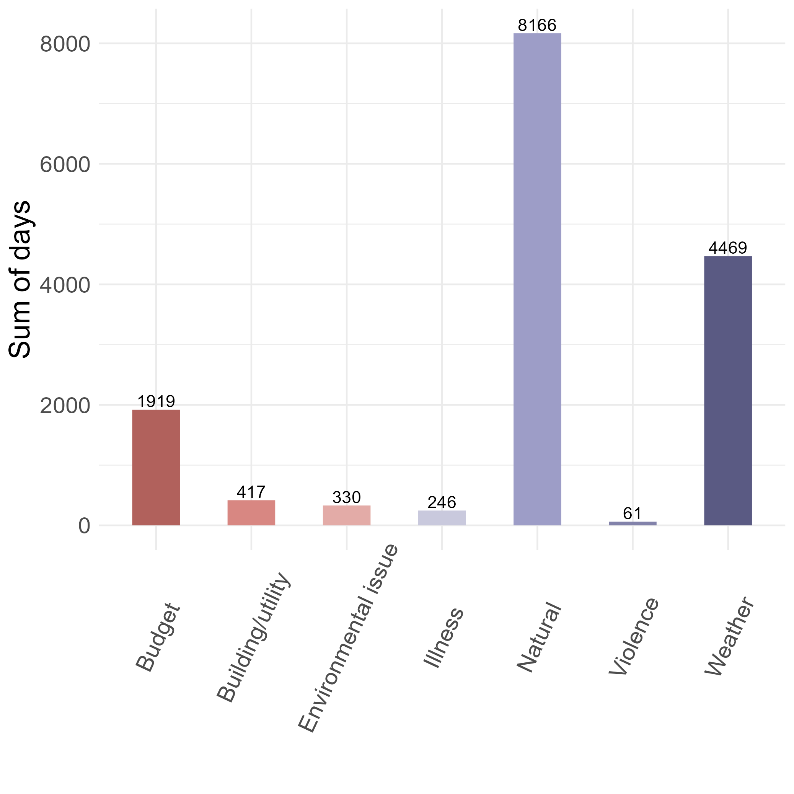
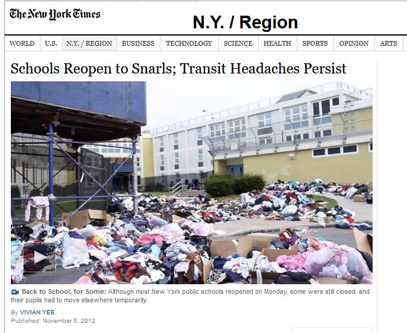
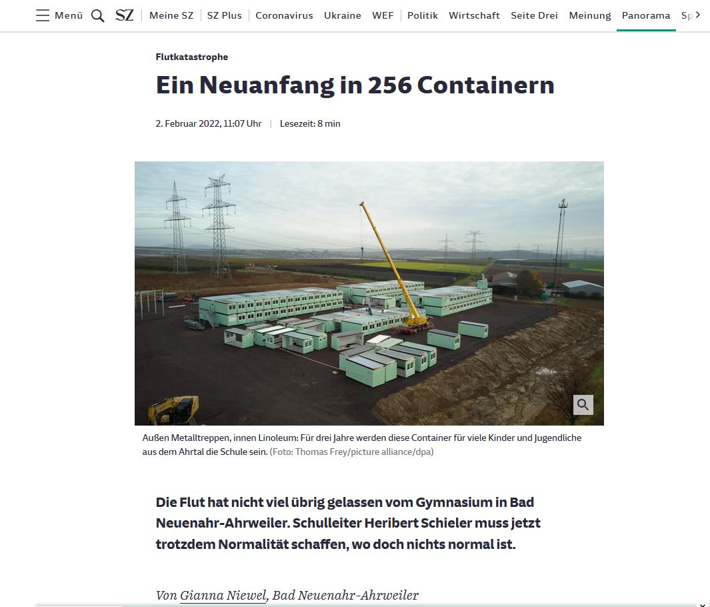
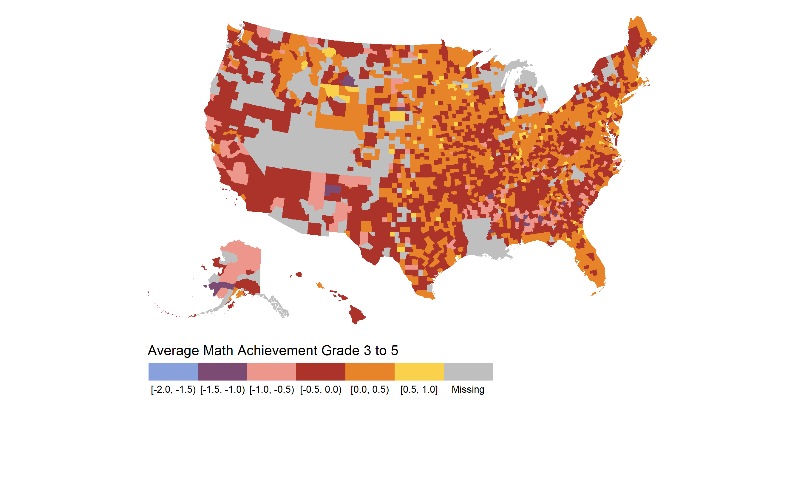
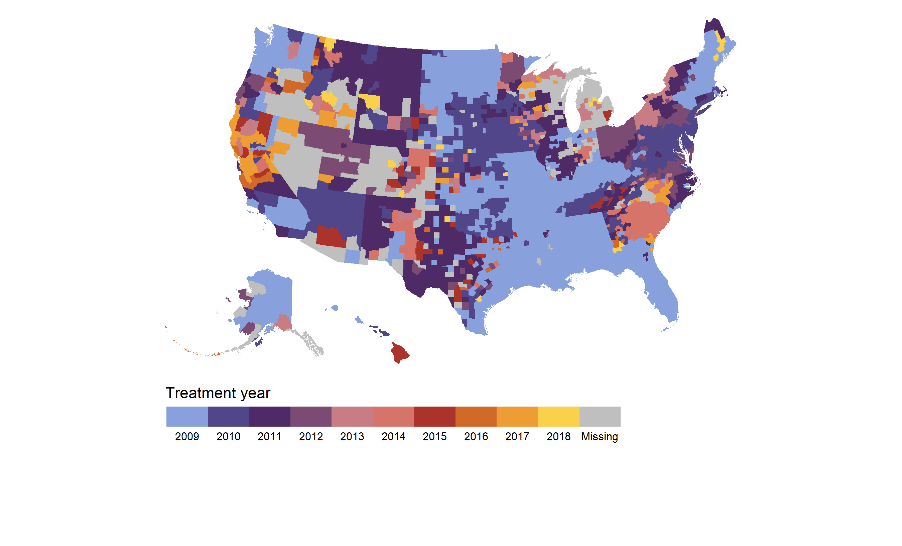
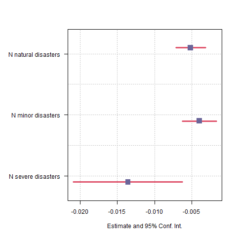
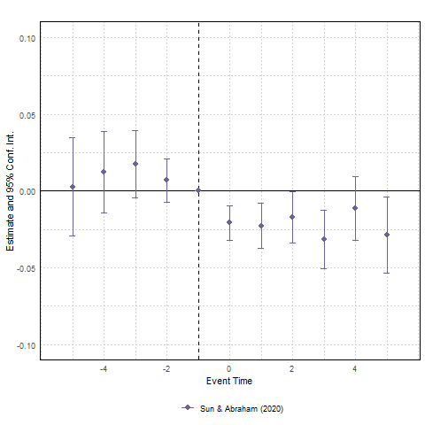
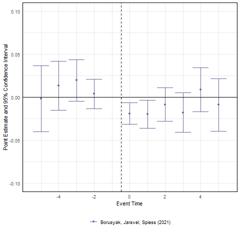
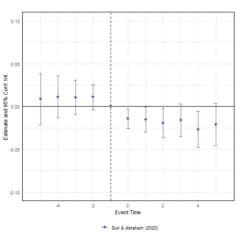
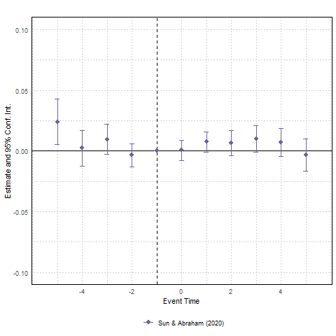

```{r include = FALSE}
library(knitr)
library(dplyr)
library(kableExtra)
library(stargazer)
library(xtable)
library(grid)
library(gridExtra)
library(ggplot2)
library(tidyverse)
library(bookdown)
library(stargazer)
library(png)
library(icons)
library(qrcode)
library(DiagrammeR)
library(sjPlot)
library(DT)
library(widgetframe)
```

```{r xaringan-tile-view, echo=FALSE}
js <- c(
  "function(settings){",
  "  var datatable = settings.oInstance.api();",
  "  var table = datatable.table().node();",
  "  $(table).append('<caption style=\"caption-side: bottom\">' + caption + '</caption>');",
  "}"
)
xaringanExtra::use_tile_view()
```

```{css echo=FALSE}
.hide-count .remark-slide-number {
  display: none;
}
```

<style type="text/css">
.remark-slide-content {
    font-size: 25px;
}
</style>


# Motivation 

.center[
```{r out.width = '70%' , echo=FALSE}
knitr::include_graphics("index/billion_dollar_disasters.JPG") 
```

Fig. 1: Billion dollar disasters
]

Source: https://www.ncei.noaa.gov/access/billions/time-series

---

# Motivation 

.pull-left[
- 22,112 prolonged unplanned school closures in 2011-2019, affecting over 13 million students that resulted in 91.5 million student-days lost (Jahan et al. 2022).
- 18.7% of all schools had at least one prolonged school closure ( $\geq$ 5 days). 
- Natural disasters (47%), adverse weather conditions (35%) are the most frequent reason.
- Hurricane Harvey led to >3000 schools closed in four states ranging from 1-19 days.
]
.pull-right[
```{r out.width = '90%' , echo=FALSE}
 
```

Fig. 2: School closure
]


Data.CDC.gov database: Prolonged Unplanned School Closures: USA, 2011-2019 

---

# Motivation

.pull-left[
- Frequency and costs of natural disasters have increased.
- This can have lasting effects on students' achievement and future earnings.
- Natural disaster can lead to school closures, breakdown of transit system.
- Most studies look at impact of natural disasters on economic growth (eg. Dell, Jones and Olken 2012) but there is less attention on the impact on students.
- Understanding the costs of natural disasters is crucial for pre- and post-disaster investment and policies.

]

.pull-right[
```{r out.width = '55%' , echo=FALSE}
 
```

```{r out.width = '55%' , echo=FALSE}
 
```
]

---

# This Paper

- Main Question: What are the effects of natural disasters on student achievement? 
- Data: Combining county level student achievement (SEDA) for 2009-2018 with disaster declarations in the US from the Federal Emergency Management Agency (FEMA) .
- Framework:  I estimate the effect of a natural disaster on student achievements in a TWFE framework.


---

# Contribution to existing literature

### Literature on specific major disasters on schools and students 
Sacerdote (2012), Di Pietro (2019), Holmes (2002), Spencer et al. (2016), Shidiqi et al. (2023) 
find negative short-run effects on students and schools. Evidence on long-run effects are mixed. 

`r fontawesome::fa('long-arrow-alt-right')` However, most disasters are not as severe as those outliers.

### Literature on school closures and absenteeism 
Covid papers eg. Werner & Woessmann (2023), teacher and student absenteeism eg. Clotfelder, Ladd, and Vigdor (2006), Miller, Murnane, and Willett (2006)

`r fontawesome::fa('long-arrow-alt-right')` Natural disaster fundamentally different from Covid. 
`r fontawesome::fa('long-arrow-alt-right')` Teacher and students absence suffers from endogeneity issues.
`r fontawesome::fa('long-arrow-alt-right')` Effect of both absenteeism and infrastructure damages are possible.

---

# Data on Student Achievement

## Stanford Education Data Archive (SEDA) 2009-2018 
**District and county level average achievement** (for all students and by race/ethnicity and gender), district and county level racial/ethnic and gender achievement gaps, and district level demographic/socioeconomic data.

- **Achievement is centered around zero**, so a score of zero means the district is at the average expected level of achievement within the United States. One-unit below zero means that students in the district are one grade level behind the average; one-unit above zero means that students in the district are one grade level above the average. 

`r fontawesome::fa('long-arrow-alt-right')`  Use county level and focus on grade 3.


```{r, echo=FALSE}
#t <- read.table(file = "../tables/seda_summary.txt", sep = ",")
#rownames(t) <- c("Achievement All Students", "Male-Female Gap", "Non-ECD-ECD Gap", "White-Black Gap", "White-Hispanic Gap")
#t %>% head() %>%
#  knitr::kable(format = "html", align = "ccc")  
 
```


---
# Data: Math scores 

.center[
```{r out.width = '45%' , echo=FALSE}
 
```

Fig. 3: Average Math Achievement Grade 3 to 5
]
---
# Data on Disasters (I): FEMA

- FEMA major disaster declarations 2009-2018 (begins in 1964)
- The disaster declaration includes the date the disaster was declared, the area, the type of incident, denotes which assistance program was declared. 
- Storms (73%), Floods (20%), Fire (7%), Drought (2%), Freezing, Earthquake, Landslide, Volcanic activity  
- One disaster can cause multiple disaster events across different counties. 
- For large disasters: Information of fatalities from EM-DAT via county and start date.
- Define severe natural disasters as disasters that caused $\geq$ 25 deaths (following Bounsat et al. 2020).

---
# Data on Disasters (II): FEMA

.center[
```{r out.width = '45%' , echo=FALSE}
 
```

Fig. 4: First year of a natural disaster
]

---
# Target Parameter 

- Problem: Staggered adoption, coefficients on lead and lag indicators in a dynamic specification can be biased with TWFE.
- Solution: reweighting following Sun and Abraham (2021)

**Cohort average treatment effect on the treated** for a treatment cohort $e$ and relative time period $l$ 

$$CATT_{e,l} = E[Y_{i,e+l} - Y^{\infty}_{i,e+l}|E_i = e]$$

$Y^{\infty}_{i,e+l}$ is the potential outcome of county $i$ in a world where it is untreated. 

Here, a treatment cohort $e$ are counties that are treated at the same time. $l$ are periods to i's initial natural disaster.

---
name: iw
# Dynamic Treatment effect following Sun & Abraham (2021)
Estimate the event study regression using "last treated" as control (C):

  $$Y_{i,t} = \alpha_i + \lambda_t + \sum_{e \notin C} \sum_{l \neq -1} CATT_{e,l}(1\{E_i =e \} \cdot D_{i,t}^l) + \epsilon_{i,t}$$
--

### The interaction weighted estimator 

Take the weighted average over all estimates for $CATT$ multiplied by the sample share of each cohort in the period $Pr(E=e)$:

$$\hat v_g = \frac{1}{|g|} \sum_{l \in g} \sum_{e} \widehat{CATT_{e,l}} \hat Pr(E_i = e| E_i \in [-l, T-l])$$
--
Main assumptions: Parallel trends for all units, Limited anticipation 
---
# Results

.center[
```{r out.width = '40%' , echo=FALSE}
knitr::include_graphics("index/sunab_fema_math_3.png") 
```

Fig. 5: Math achievement in grade 3 
]

---

# Alternative specification 

Do more disasters cause more harm?


  $$Y_{i,t} = \alpha_i + \lambda_t + \beta Disaster_{i,t} + \delta'(\mathbf{X}_i \lambda_t) +  \epsilon_{i,t},$$
where $Disaster_{i,t}$ is the number and severity of a natural disasters in the past 5 years in a county and year, $\alpha_i$  and $\lambda_t$ are county and year fixed effects, $\mathbf{X}_i \lambda_t$ includes an interaction between initial county population and a linear time trend. 

The preferred measure of a "severe" disaster is one that caused 25 or more deaths, following Boustan et al. (2020). 

---
# Results: Larger natural disasters cause more harm

.center[
```{r out.width = '40%' , echo=FALSE}
 
```

Fig. 6: Number of natural disasters in the past 5 years.
]
---
name: robustness
# Robustness and Sensitivity

- Using never treated as [control](#nevertreated). 
- Results look similar with [Borusyak, Jaravel, and Spiess (2023)](#borus).
- Does age matter? Similar effects for kids in [grade 4 and 5](#grade45). 
- What about movers? [enrollment](#enrollment). 

---
# Conclusion (for now)

- What is the effect of natural disasters on students?
- Setting: US where already now 80% of the prolonged unplanned school closures are due to natural disasters and adverse weather conditions.
- Evidence points to a negative effect of natural disaster on student achievement in the year of the natural disaster.
- More natural disasters cause more harm. This effect is larger for large natural disasters. 

Next step:
- Which types of disaster matter?
- Are there effects on achievement gaps? 
- Explore the channels. 

---
class: middle, center, inverse

Get in contact!

```{r include = FALSE}
qr <- qr_code("mailto:gust@ifo.de")
png(filename="index/qrplot.png")
plot(qr)
dev.off()
```

```{r, echo=FALSE, out.width = "20%",fig.show = "hold"}

```


`r fontawesome::fa('envelope')` [gust@ifo.de](mailto:gust@ifo.de) 
`r fontawesome::fa('twitter')` [https://twitter.com/sarages](https://twitter.com/sarages)
`r fontawesome::fa('firefox-browser')` [https://www.ifo.de/en/gust-s](https://www.ifo.de/en/gust-s)

---
# Descriptive Table

```{r descr, echo=FALSE}
t <- read.csv(file = "index/seda_summary.csv", sep = ",")
font.size <- "8pt"
t %>% datatable(rownames = FALSE, 
    options = list(
      drawCallback = JS(js),
      scrollY = 400,
      pageLength = 20,
        initComplete = htmlwidgets::JS(
          "function(settings, json) {",
          paste0("$(this.api().table().container()).css({'font-size': '", font.size, "'});"),
          "}")
    ),
    height = 600,
  ) %>% frameWidget() 
```


---
name: nevertreated

# Sun and Abraham with never treated 
.center[
```{r out.width = '50%' , echo=FALSE}
 
```
]
[Go back](#robustness)

---
name: borus
# Imputation method 

.center[
```{r out.width = '45%' , echo=FALSE}
 
```
]

Intuition: Borusyak et al. 2021 imputes Y(0) with not-yet treated and never treated units. 

[Go back](#robustness)

---
name: grade45

# Results for Grade 4 and 5 

.center[
```{r out.width = '40%' , echo=FALSE}
 
knitr::include_graphics("index/sunab_fema_math_5.png") 
```
]
[Go back](#robustness)

---
name: enrollment
# Enrollment

.center[
```{r out.width = '45%' , echo=FALSE}
 
```
]

[Go back](#robustness)